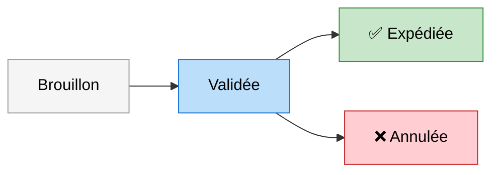

# Atelier 02 : le flux de commande

## Contexte

La commande traverse plusieurs états. On veut interdire les transitions illégales.

## Objectif

Décrire la machine à états puis l'implémenter.

## Transitions autorisées

## À produire

1. Le type des états
2. La fonction `transition(etat, action)`
3. Un test par transition interdite

## Piège

Une commande expédiée ne peut plus être annulée. Vérifiez que votre implémentation
le refuse plutôt que de l'ignorer silencieusement.
