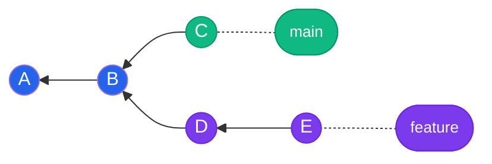
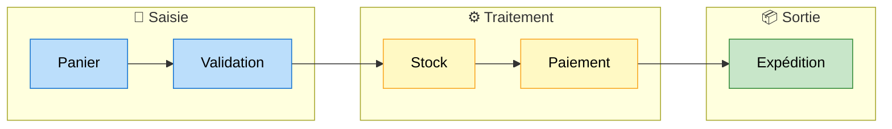
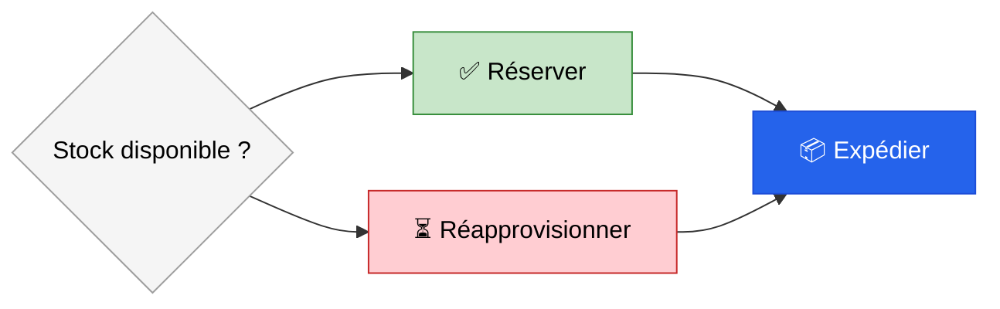
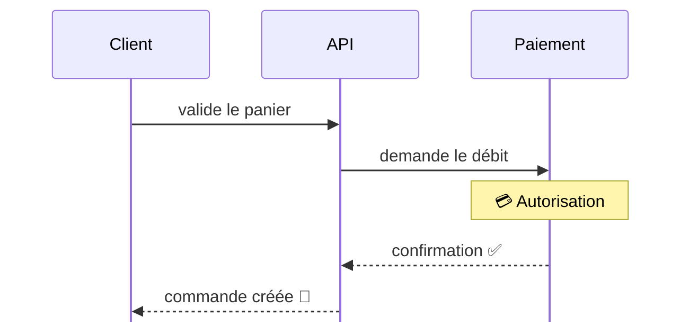

## Graphe de commits

<!-- .slide: style="--mermaid-bg: transparent;" -->

Note: Formes rondes pour les commits, formes stade pour les étiquettes de branche.

---

## Chaîne de traitement

<!-- .slide: style="--mermaid-bg: transparent;" -->

Note: Trois sous-graphes titrés avec emoji, une couleur par étape.

---

## Arbre de décision

<!-- .slide: style="--mermaid-bg: transparent;" -->

Note: L'issue est portée par le nœud, pas par un libellé de flèche.

---

## Échange entre acteurs

